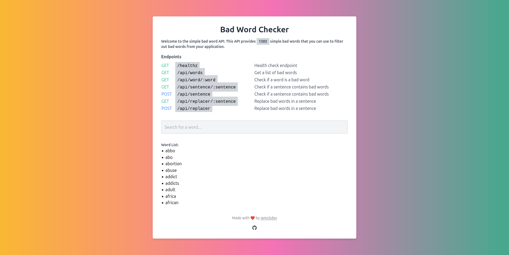

<div align="center">

# Simple Bad Word Checker


[](https://opensource.org/licenses/MIT) [](https://github.com/arnonsang/badwords/stargazers) [](https://github.com/arnonsang/badwords/issues)  

A simple and lightweight API for filtering and checking bad words, built with [Go](https://go.dev/) and [Echo](https://echo.labstack.com/).

[Features](#-features) • [Usage](#-usage) • [Installation](#-installation) • [API](#api-endpoints) • [Todo](#-to-do-list) • [Contributing](#-contributing) • [Acknowledgments](#-acknowledgments) • [License](#license)



</div>

## 🌟 Features

- 📋 Retrieve a comprehensive list of bad words via API
- ✅ Check if a specific word is considered inappropriate
- 🌐 User-friendly web interface for easy testing and usage
- 🐳 Docker support for simple deployment

## 🚀 Usage

### API Endpoints

| Method | Endpoint                  | Description                                       |
| ------ | ------------------------- | ------------------------------------------------- |
| GET    | `/healthz`                | Health check endpoint                             |
| GET    | `/api/words`              | Get a list of bad words                          |
| GET    | `/api/word/:word`         | Check if a word is a bad word                    |
| GET    | `/api/sentence/:sentence` | Check if a sentence contains bad words            |
| POST   | `/api/sentence`           | Check if a sentence contains bad words            |
| GET    | `/api/replacer/:sentence` | Replace bad words in a sentence                   |
| POST   | `/api/replacer`           | Replace bad words in a sentence                   |


### Web Interface

Access the intuitive web interface by navigating to [badword.iamickdev.com](https://badwords.iamickdev.com)


## 📝 TODO List

| Task                           | Status          | Description                               |
|--------------------------------|-----------------|-------------------------------------------|
| Migrate static word set to database   | ⚙️ In Progress   | Move the static word set to a database for better management and scalability |
| Create endpoint to let everyone can add more word   | ⚙️ In Progress  | Implement an API endpoint to allow users to add additional bad words dynamically |
| Add languages detector and support more languages   | 🟡 Pending     | Integrate language detection to support filtering bad words in multiple languages |


## 💻 Installation

1. Clone this repository:
```bash
git clone https://github.com/arnonsang/badwords.git
```
2. Navigate to the project directory:
```bash
cd your_project_dir
```
3. Build and run via docker compose:
```bash
docker-compose up -d
```
4. Access the application at `http://localhost:8089` in your browser.

## ⚙️ Makefile Commands

| Command | Description |
|---------|-------------|
| `make build` | Builds the Docker image |
| `make up` | Starts the application using Docker Compose |
| `make up-detached` | Starts the application in detached mode |
| `make down` | Stops and removes the containers |
| `make clean` | Removes the Docker image |
| `make restart` | Restarts the application |
| `make logs` | Tails the logs of the running containers |
| `make status` | Shows the status of the running containers |

## 📦 Dependencies

- [Go](https://golang.org/) - The programming language powering the server
- [Echo](https://echo.labstack.com/) - High performance, extensible, minimalist Go web framework
- [Tailwind CSS](https://tailwindcss.com/) - A utility-first CSS framework for rapid UI development

## 📁 Project Structure
```bash
├── assets
│   └── badwords.go
├── docker-compose.yml
├── Dockerfile
├── go.mod
├── go.sum
├── LICENSE
├── main.go
├── Makefile
├── presentation
│   └── server.go
├── README.md
├── static
│   ├── android-chrome-192x192.png
│   ├── android-chrome-512x512.png
│   ├── apple-touch-icon.png
│   ├── favicon-16x16.png
│   ├── favicon-32x32.png
│   ├── favicon.ico
│   ├── images
│   │   └── github-mark.svg
│   ├── index.html
│   ├── screenshot.png
│   └── site.webmanifest
└── usecase
    └── badwords.go
```

## 🎉 Contributing

Contributions, issues, and feature requests are welcome! Feel free to check [issues page](https://github.com/arnonsang/badwords/issues) or open [pull request](https://github.com/arnonsang/badwords/pulls).

## 📄 License

This project is licensed under the MIT License - see the [LICENSE](LICENSE) file for details.

## 🙏 Acknowledgments

We'd like to tip our hats to:

- The awesome folks at **[favicon.io](https://favicon.io/favicon-generator/)** for their fantastic favicon generator. It's made our app look snazzy!
- The brilliant minds at **[Carnegie Mellon University](https://www.cs.cmu.edu/~biglou/resources/bad-words.txt)** for providing a comprehensive list of bad words. Your work helps keep the internet a little cleaner!

Your resources have been invaluable in making this project shine. Thank you! 🌟

## Author

Made with ❤️ by **[iamickdev](https://www.iamickdev.com)**
- Website: [www.iamickdev.com](https://www.iamickdev.com)
- Github: [@arnonsang](https://github.com/arnonsang)

---

**From JLR Lab**  
*A Gen Z technology research, consulting and development team based in Thailand.*

